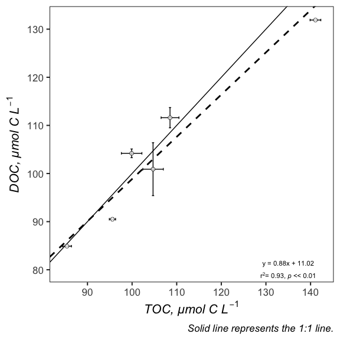
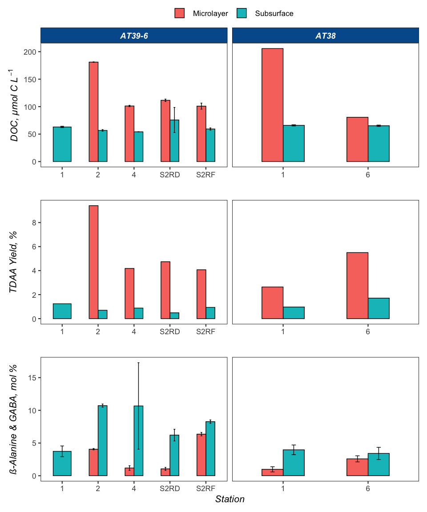

Microlayer
================
Nicholas Baetge
5/25/2020

``` r
library(tidyverse) 
library(googledrive)
library(googlesheets4)
library(rmarkdown)
library(knitr)
library(readxl)
library(data.table) 
library(scales)
library(zoo)
library(oce)
library(patchwork)
#rmarkdown tables
library(stargazer)
library(pander)
library(growthcurver)
#stat tests
library(lmtest)
library(lmodel2)
library(rstatix)
library(ggpubr)
```

# Import and wrangle data

## TOC and DOC from NAAMES Bottle File

For the microlayer samples, we collected corresponding Total Organic
Carbon and Dissolved Organic Carbon (TOC/DOC, respectively) samples six
times total. In those samples, the mean offset between the two
measurements was ~4% (col = ave\_percent\_diff). There is good agreement
between the microlayer TOC and DOC samples (see section **Regressions**
below) There are several samples where we only collected either TOC or
DOC (lol…). So for those samples, what we’ve done is to apply the mean
difference as a correction factor. Thus, corrected DOC values (column =
DOC\_corr) equals: TOC - (TOC \* average percent difference between TOC
and DOC) . We’ve added a corresponding column with numerical flags that
indicate which microlayer samples have been corrected \[2\] and which
have not \[1\]. The units for TOC and DOC are µmol
C/L.

``` r
google.df <- read_sheet("https://docs.google.com/spreadsheets/d/1zw-W1k__BeuJg1oQpQQ_XT7zWLiY3dfL-dTaQ0pzN5Q/edit#gid=1446474071", sheet = "Bottle File", skip = 1, col_types = "ccc?D?dddddddcdddddddddddddddddddddddddddddddddddddddddddddddddddddddddddddddddddddddddddddddddddddddddddddddddddddddddddddddcccccdddddcdd") %>% 
  #Station variable is read as numeric, so read_sheet turns station "1A" into an NA.
  #we'll replace it with a 0
  mutate(Station = ifelse(is.na(Station), 0, Station)) %>% 
  mutate_at(vars(TOC, TOC_sd, DOC, DOC_sd), round, 1)

microlayer <- google.df %>% 
  filter(Cruise %in% c("AT38", "AT39-6"), Cast_Type %in% c("Microlayer")) %>% 
  select(Cruise:Date, Latitude, Longitude, CruiseCN:Target_Z, TOC, TOC_sd, DOC, DOC_sd) %>% 
  distinct() %>% 
  filter(!Cruise == "AT39-6" | !Station == 2 | !SCN == 2) %>% 
  mutate(percent_diff = round((abs((DOC - TOC)) / ((DOC + TOC)/2)) * 100, 2),
         ave_percent_diff = round(mean(percent_diff, na.rm = T), 2),
         DOC_corr = ifelse(is.na(DOC), round(TOC - (ave_percent_diff/100 * TOC), 1), NA),
         DOC_corr_flag = ifelse(is.na(DOC), 2, 1)) 

subsurface <- google.df %>% 
   filter(Cruise %in% c("AT38", "AT39-6"), Cast_Type %in% c("Deep", "Flow-through"), Target_Z %in% c(0.1, 1, 5)) %>% 
 select(Cruise:Date, Latitude, Longitude, CruiseCN:Target_Z, TOC, TOC_sd, DOC, DOC_sd) %>% 
  distinct() %>% 
  drop_na(DOC)

doc_toc <- bind_rows(subsurface, microlayer)  %>% 
  arrange(Date, Time_Stamp) %>% 
   mutate(DOC_corr = ifelse(is.na(DOC_corr), DOC, DOC_corr)) 
```

## Total Dissolved Amino Acids

``` r
tdaa <- read_excel("~/naames_microlayer/Input/NAAMES_AA_Master.xlsx", sheet = 1) %>% 
  select(-c(run, sample)) %>% 
  mutate_at(vars(tdaa_ave:mol_per_lys), round, 2)
```

# Merge data

Here we’ll also calculate the % TDAA yield (tdaa\_yield):

1)  convert the carbon concentration of the TDAAs (tdaa\_c\_ave) from
    nmol C L<sup>-1</sup> to µmol C L<sup>-1</sup>
2)  normalize the concentration to the bulk DOC concentratation
    (corrected DOC values for microlayer samples in which only TOC was
    directly estimates): tdaa\_c\_ave/DOC\_corr
3)  express as percent

<!-- end list -->

``` r
merged <- doc_toc %>% 
  left_join(., tdaa) %>% 
  mutate(tdaa_yield = round(((tdaa_c_ave/1000)/DOC_corr)*100, 2)) %>% 
  drop_na(tdaa_yield) %>% 
  arrange(Cruise, Time_Stamp)
```

# Save data

``` r
saveRDS(merged, "~/naames_microlayer/Output/processed_microlayer.rds")
write_csv(merged, "~/naames_microlayer/Output/processed_microlayer.csv")
```

# Regressions

``` r
microlayer.reg <- lmodel2(DOC ~ TOC, data = microlayer, nperm = 99)

microlayer.reg
```

    ## 
    ## Model II regression
    ## 
    ## Call: lmodel2(formula = DOC ~ TOC, data = microlayer, nperm = 99)
    ## 
    ## n = 6   r = 0.9668345   r-square = 0.9347689 
    ## Parametric P-values:   2-tailed = 0.00163169    1-tailed = 0.0008158451 
    ## Angle between the two OLS regression lines = 1.915692 degrees
    ## 
    ## Permutation tests of OLS, MA, RMA slopes: 1-tailed, tail corresponding to sign
    ## A permutation test of r is equivalent to a permutation test of the OLS slope
    ## P-perm for SMA = NA because the SMA slope cannot be tested
    ## 
    ## Regression results
    ##   Method Intercept     Slope Angle (degrees) P-perm (1-tailed)
    ## 1    OLS  14.19922 0.8482442        40.30608              0.03
    ## 2     MA  11.53229 0.8734356        41.13512              0.03
    ## 3    SMA  11.11876 0.8773417        41.26183                NA
    ## 
    ## Confidence intervals
    ##   Method 2.5%-Intercept 97.5%-Intercept 2.5%-Slope 97.5%-Slope
    ## 1    OLS      -19.17266        47.57110  0.5371761    1.159312
    ## 2     MA      -29.58752        41.22421  0.5929703    1.261847
    ## 3    SMA      -27.47829        38.38518  0.6197874    1.241923
    ## 
    ## Eigenvalues: 630.0524 10.43826 
    ## 
    ## H statistic used for computing C.I. of MA: 0.03301265



# Bar plots


